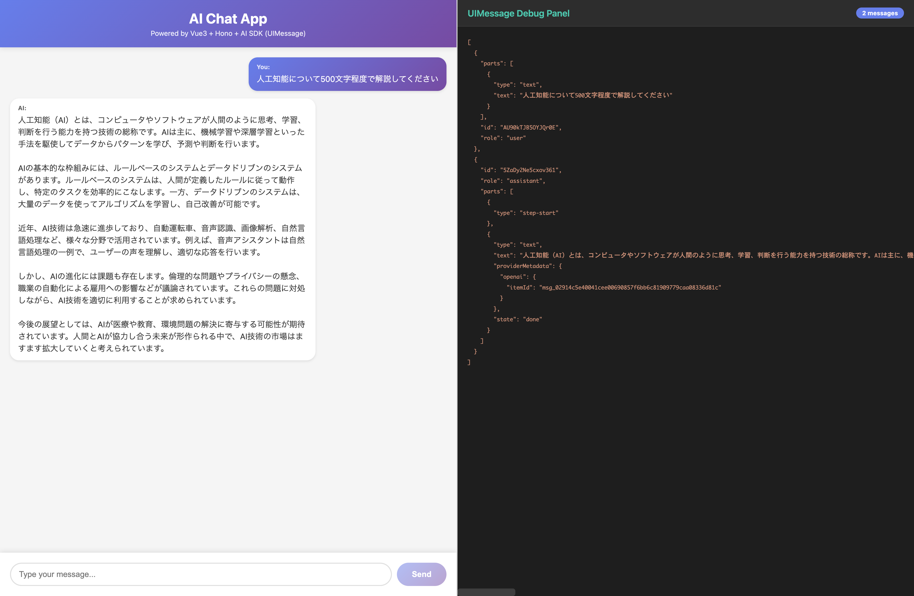

# Vue3 + Hono + AI SDK Chat App

Real-time streaming chat application built with Vue3, Hono, and AI SDK, featuring UIMessage format support and a live debug panel.

## Features

- **Real-time Streaming**: Character-by-character AI responses using AI SDK's streaming capabilities
- **UIMessage Format**: Full support for AI SDK's UIMessage structure with `parts` array
- **Debug Panel**: Live JSON viewer showing the complete UIMessage structure in real-time
- **Modern Stack**: Vue3 with Composition API, Hono for backend, and OpenAI GPT-4o-mini
- **TypeScript**: Fully typed for better developer experience
- **2-Column Layout**: Chat interface on the left, debug panel on the right

## Screenshots

### Chat Interface with Debug Panel



The application features a split-screen layout:
- **Left**: Beautiful gradient-styled chat interface
- **Right**: Dark-themed VS Code-style debug panel showing UIMessage JSON structure

The debug panel displays:
- Message count in real-time
- Complete UIMessage structure including:
  - `parts` array with text and metadata
  - Streaming states (`step-start`, `done`)
  - Provider metadata (OpenAI item IDs)
  - Message IDs and roles

## Tech Stack

- **Frontend**: Vue3, TypeScript, Vite
- **Backend**: Hono (lightweight web framework)
- **AI**: AI SDK (@ai-sdk/vue, @ai-sdk/openai)
- **Model**: OpenAI GPT-4o-mini

## Prerequisites

- Node.js 18 or higher
- OpenAI API key

## Installation

1. Clone the repository:
```bash
git clone https://github.com/wadakatu/vue-hono-aisdk-chat.git
cd vue-hono-aisdk-chat
```

2. Install dependencies:
```bash
npm install
```

3. Create a `.env` file in the root directory and add your OpenAI API key:
```env
OPENAI_API_KEY=your_api_key_here
```

## Usage

1. Start the development server:
```bash
npm run dev
```

This will start:
- **Frontend (Vite)**: http://localhost:5173
- **Backend (Hono)**: http://localhost:3001

2. Open your browser and navigate to http://localhost:5173

3. Start chatting with the AI! Watch the debug panel on the right to see the UIMessage structure in real-time.

## Project Structure

```
vue-hono-aisdk-chat/
├── src/
│   ├── client/           # Vue3 frontend
│   │   ├── App.vue       # Main component with chat UI and debug panel
│   │   ├── main.ts       # Vue app entry point
│   │   └── style.css     # Global styles
│   └── server/           # Hono backend
│       └── index.ts      # API endpoints and streaming logic
├── index.html            # HTML entry point
├── vite.config.ts        # Vite configuration with proxy
├── tsconfig.json         # TypeScript configuration
└── package.json          # Dependencies and scripts
```

## Key Implementation Details

### UIMessage Structure

The application uses AI SDK's UIMessage format, which provides a rich structure for chat messages:

```typescript
{
  "id": "unique-id",
  "role": "user" | "assistant",
  "parts": [
    {
      "type": "text",
      "text": "Message content",
      "state": "done",
      "providerMetadata": { ... }
    }
  ]
}
```

### Server-Side Conversion

The server converts UIMessage[] to ModelMessage[] using `convertToModelMessages()`:

```typescript
// src/server/index.ts
const { messages } = await c.req.json()
const modelMessages = convertToModelMessages(messages)

const result = streamText({
  model: openai('gpt-4o-mini'),
  messages: modelMessages,
})

return result.toUIMessageStreamResponse()
```

### Client-Side Chat Class

The frontend uses `@ai-sdk/vue`'s Chat class for reactive state management:

```typescript
import { Chat } from '@ai-sdk/vue'

const chat = new Chat({
  api: '/api/chat',
  messages: []
})

// Send message
chat.sendMessage({ text: message })
```

## Development

### Available Scripts

- `npm run dev` - Start both frontend and backend in development mode
- `npm run dev:client` - Start only the Vite dev server
- `npm run dev:server` - Start only the Hono server

### API Endpoints

- `POST /api/chat` - Stream chat responses using UIMessage format

## Environment Variables

Create a `.env` file with the following:

```env
OPENAI_API_KEY=your_openai_api_key
```

## Contributing

Contributions are welcome! Please feel free to submit a Pull Request.

## License

MIT

## Acknowledgments

Built with [Claude Code](https://claude.com/claude-code)
